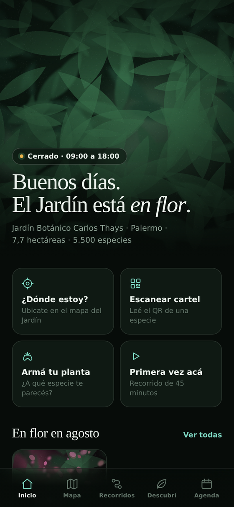
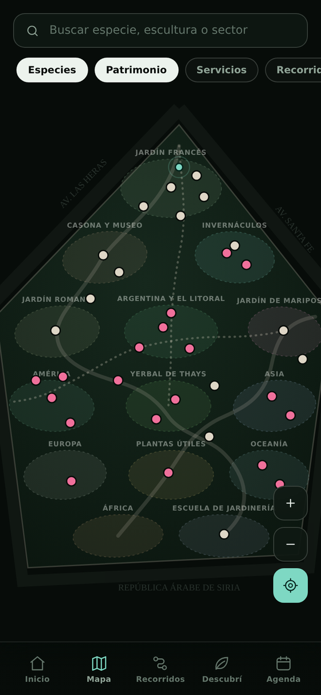
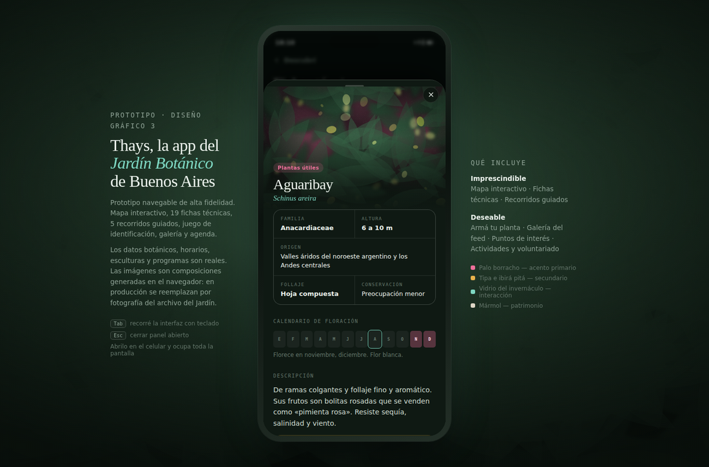

# Thays — App del Jardín Botánico de Buenos Aires

Prototipo navegable de alta fidelidad y documentación de producto completa para una app del **Jardín Botánico Carlos Thays** (Palermo, CABA).

Material de cátedra para **Diseño Gráfico 3**, FADU. Trabajo académico sin fines comerciales.

### ▶ [Ver el prototipo](https://juanmcompa.github.io/Botanico_webapp/) · 📗 [Ver la documentación](https://juanmcompa.github.io/Botanico_webapp/dossier.html)

<p>
  
  
</p>

---

## Qué es

Una app de sitio para el visitante del Jardín. El problema que ataca es concreto: el Jardín tiene 5.500 especies y más de treinta esculturas, y el visitante promedio se queda veinte minutos y se va sin entender nada de lo que vio. No es un problema de contenido —el contenido está— sino de canal.

| | |
|---|---|
| **Imprescindible** | Mapa interactivo · Fichas técnicas · Recorridos prearmados |
| **Deseable** | Armá tu planta · Galería del feed · Puntos de interés · Actividades y voluntariado |
| **Dirección visual** | Naturaleza inmersiva — tema oscuro, imagen a sangre, interfaz flotante |
| **Plataforma** | App web, mobile first. En escritorio se ve enmarcada como teléfono; en mobile ocupa toda la pantalla |

## Cómo verlo

Entrá al [link de arriba](https://juanmcompa.github.io/Botanico_webapp/), o descargá `index.html` y abrilo en Chrome.

**No necesita servidor ni instalación**: es un único archivo HTML autónomo, sin dependencias más allá de las tipografías de Google Fonts. En un teléfono se ve a pantalla completa, como una app nativa. En escritorio aparece dentro de un marco de teléfono, con las notas del proyecto a los costados.



## Contenido del prototipo

- **La rueda del año** — la pantalla de inicio es un calendario radial de floración: doce sectores, cada uno teñido con lo que florece ese mes y con qué intensidad. Se gira arrastrando o tocando un mes, y el Jardín cambia de color delante tuyo.
- **Mapa trazado sobre el plano oficial** — perímetro real, los 14 sectores de la leyenda institucional, la Escuela Técnica de Jardinería como predio propio, Plaza Intendente Casares, los cinco invernáculos y los puntos A–J. Capas conmutables —incluida «en flor», un mapa de calor botánico que cambia con la estación—, buscador unificado, entrada animada y una segunda planta con el interior del Invernáculo N.º 1.
- **Audioguía numerada** — cada parada tiene número de audio, reproducción con la voz del navegador, control de velocidad y transcripción completa. Teclado numérico para marcar el número del cartel sin cámara ni señal.
- **36 fichas técnicas** — familia, origen, porte, calendario de floración mes a mes, estado de conservación, descripción, usos y un dato memorable por especie.
- **5 recorridos guiados + el tuyo** — barra persistente estilo audioguía de museo (Anterior · Listado · Teclado · Mapa · Siguiente), pines numerados con auricular, navegación paso a paso con distancia y giro calculados sobre el plano, y armado de recorrido propio compartible por link.
- **Accesibilidad** — tres tamaños de texto, alto contraste, transcripciones permanentes, capa de sanitarios accesibles, rampas y bancos, y ficha de accesibilidad por recorrido (superficie, pendiente, sombra, silla de ruedas, duración a paso lento).
- **28 puntos de interés** — invernáculo art nouveau, edificio central, columna meteorológica, esculturas, jardín de mariposas, yerbal histórico, refugio climático.
- **Armá tu planta** — juego de identificación por rasgos (hoja, flor, tronco, hábitat) con porcentaje de coincidencia contra el catálogo.
- **Galería** — grilla del feed con filtros temáticos y visor.
- **Agenda y voluntariado** — actividades reales del Jardín y los tres programas del Área Educativa con formulario de postulación.

## Estructura del repositorio

```
├── index.html                            El prototipo navegable
├── dossier.html                          La investigación de UX, en 22 slides navegables
├── docs/
│   └── documentacion-de-producto.md      La misma documentación, en Markdown editable
├── capturas/                             Capturas de las pantallas principales
├── fotos/                                Dejá acá las fotos reales: ver fotos/LEEME.md
└── .nojekyll                             Para que GitHub Pages sirva el HTML tal cual
```

## La documentación

`dossier.html` es una **presentación de 22 slides** navegable con las flechas del teclado. Su columna vertebral es la investigación de UX: porque mis usuarios son estos → mi hipótesis es esta → entonces la app hace esto → y así lo mediría. Incluye método (qué es evidencia y qué es supuesto), las cuatro personas, tres cadenas hipótesis→decisión, accesibilidad como requisito de partida, la lista de lo que decidimos no hacer y una slide de honestidad sobre lo que todavía no se probó.

`docs/documentacion-de-producto.md` es la referencia larga: especificación funcional por módulo, modelo de datos, sistema de diseño, notas técnicas, riesgos, roadmap, guion de demo y ejercicios para clase.

## Sobre los datos y las imágenes

**Los datos son reales.** Historia, superficie, sectores fitogeográficos, especies con su nombre científico y su familia, esculturas con autor, horarios, programación y los tres programas de voluntariado provienen de fuentes públicas del Gobierno de la Ciudad de Buenos Aires y del Área Educativa del Jardín.

**Las imágenes no son fotografías.** Son composiciones atmosféricas generadas en `<canvas>` por una función determinista: cada elemento recibe siempre la misma imagen a partir de su identificador. Se resolvió así porque no hay derechos sobre el material fotográfico del archivo del Jardín.

**Hay 22 fotografías reales integradas**, aportadas para el prototipo y mapeadas por nombre en el objeto `FOTOS` del código. Para sumar más alcanza con dejar los archivos en `fotos/` con el identificador como nombre (`ombu.jpg`, `jacaranda.jpg`): la app las detecta sola y las superpone con un fundido; si falta alguna, usa la composición generada. El estado de cada una está en [`fotos/LEEME.md`](fotos/LEEME.md).

## Fuentes

- [Agenda del Jardín Botánico](https://buenosaires.gob.ar/vicejefatura/ambiente/jardin-botanico/agenda-del-jardin-botanico) — GCBA
- [Sendero «Árboles de mi Ciudad»](https://www.buenosaires.gob.ar/jardinbotanico/recorre-el-jardin/sendero-arboles-de-mi-ciudad) — GCBA
- [Jardín Botánico Carlos Thays](https://buenosaires.gob.ar/areas/med_ambiente/espacios_verdes/botanico.php?menu_id=6449) — GCBA
- [Voluntariados en Educación](https://educacionjbct.wordpress.com/voluntariado/) — Área Educativa del Jardín Botánico Carlos Thays
- [Jardín botánico de Buenos Aires](https://es.wikipedia.org/wiki/Jard%C3%ADn_bot%C3%A1nico_de_Buenos_Aires) — Wikipedia
- [Una sinfonía viva de arte, ciencia y memoria](https://palermonline.com.ar/wordpress/el-jardin-botanico-de-buenos-aires-una-sinfonia-viva-de-arte-ciencia-y-memoria/) — Palermonline

## Licencia y aviso

Publicado bajo [CC0 1.0 Universal](LICENSE): dedicación al dominio público, uso libre sin necesidad de atribución.

Este es un **ejercicio académico**. No representa, ni fue encargado por, el Gobierno de la Ciudad de Buenos Aires ni el Jardín Botánico Carlos Thays. Los nombres y datos de la institución se usan con fines didácticos.
